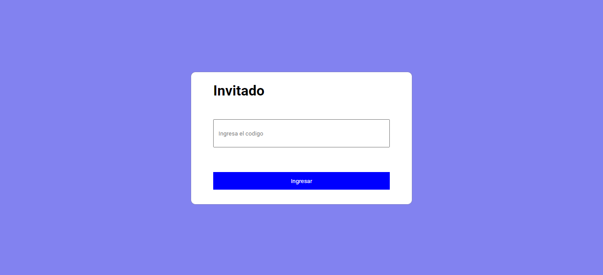
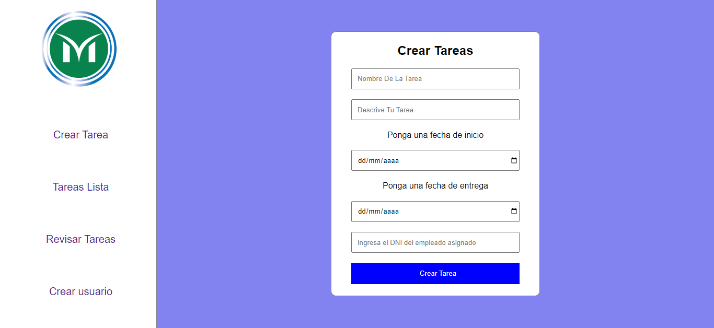
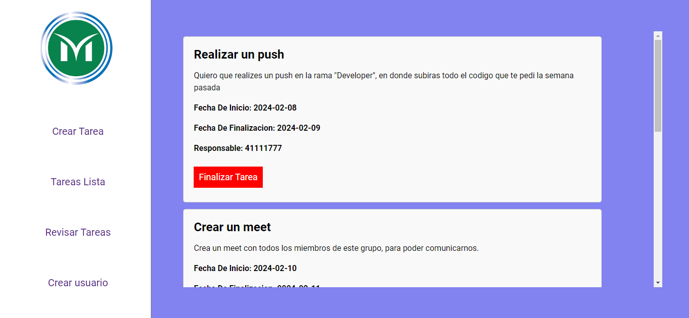
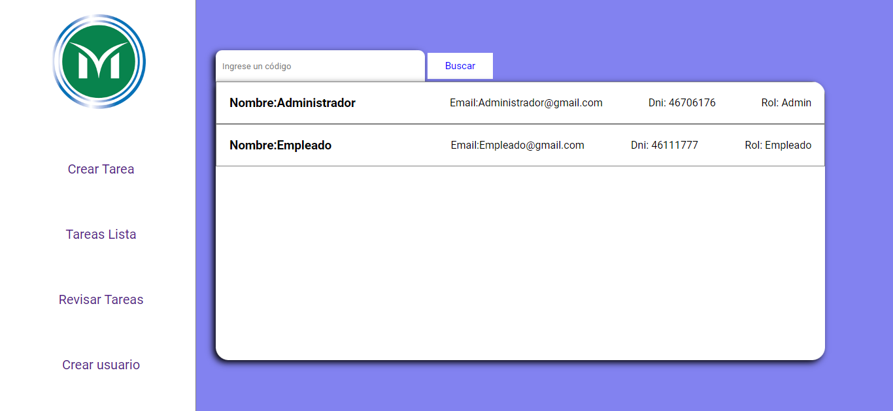

<h1 align="left">Prueba Técnica Municipalidad De Merlo</h1>

<h2 aling="left">¿Qué es?</h2>

  Este código es la resolución de una prueba técnica impuesta por la Municipalidad de Merlo. En esta prueba, se debía crear un sistema según mi criterio, incorporando las tecnologías que 
  utilizan diariamente. El sistema creado es un área de trabajo que permite a los administradores (jefes) asignar tareas a sus empleados. Los empleados pueden completar las tareas 
  asignadas y notificar a sus jefes una vez completadas.

<h2 align="left">Tecnologías utilizadas:</h2>

  
  
  
  
  
  
  
  
  
  
  

<h1 align="left">Vistas</h1>

<h3 align="left">Registro</h3>

  Una vista donde el administrador puede crear perfiles para los empleados, y si lo desea, también puede crear otros administradores.

<h3 align="left">Invitados</h3>

  Una vista donde los usuarios acceden a su cuenta, ya sean administradores o empleados.

<h3 align="left">Crear Tareas</h3>

  Una vista donde el administrador de la sala puede crear tareas y asignarlas a los empleados de su sala.

<h3 align="left">Lista De Tareas</h3>

  Una vista donde los empleados pueden visualizar todas las tareas que se les asignaron. Si el administrador accede, se mostrarán todas las tareas creadas.

<h3 align="left">Buscador De Usuarios</h3>

  Una vista donde el administrador de la sala puede ver a todos los usuarios que han accedido al sistema, ya sean administradores o empleados, y puede buscarlos por su nombre.

<h2 aling="left">Descarga La Base de Datos 😀</h2>

 Puedes descargar la base de datos para utilizar el proyecto en caso de no funcionarte el docker 

### Estructura

La base de datos tiene las siguientes tablas:

- `Usuarios`: Una tabla con todos los usuarios existentes y sus roles.
- `Tareas`: Aqui se guardan las tareas de los usuarios.

### Instrucciones

1. Descarga la base de datos desde [https://drive.google.com/file/d/15dAdiYLIyVtHFa2oVN3_kdAjaZd_Qqpi/view?usp=sharing](enlace).
