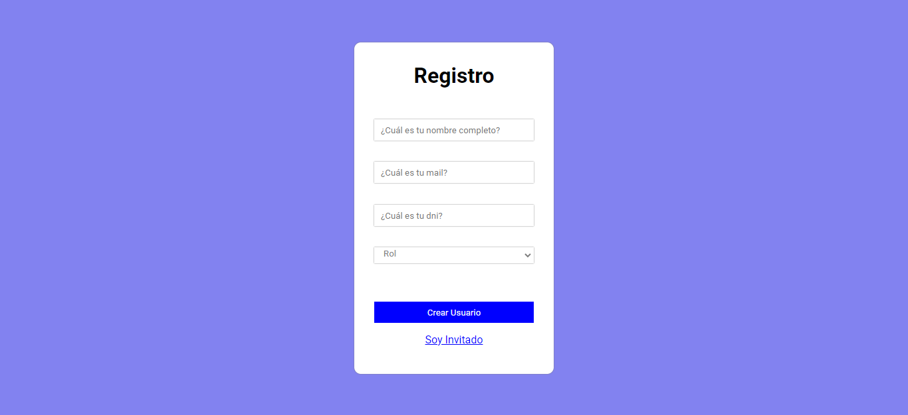

<h1 align="left">Prueba Tecnica Municipalidad De Merlo</h1>

###
  
###

<h2 align="left">Tecnologias utilisadas:</h2>

###

  
  
  
  
  
  
  
  
  
  
  

###
<h2 align="left">Vistas</h2>

<h3 align="left">Register</h3>

 
 

  Una vista en donde el administrador puede crear los perfiles de los empleados, si tambien lo desea puede crear a otros administradores.

<h3 align="left">Invitados</h3>

  Una vista en donde los usuarios acceden a su cuenta, ya sean administradores o empleados.

<h3 align="left">Crear Tareas</h3>

  Una vista en donde el administrador de la sala puede crear las tareas y asignarlas a los empleados que tenga en su sala.

<h3 align="left">Lista De Tareas</h3>

  Una vista en donde el los empleados pueden visualisar todas las tareas quese les asignaron, si el administrador accede se mostraran todas las tareas creadas.

<h3 align="left">Buscador De Usuarios</h3>

  Una vista en donde el administrador de la sala ve a todos los usuarios que accedieron al sistema, ya sea un administrador o un empleado, pudiendo buscarlos por su nombre. 

<h2 align="left">Contador De Visitantes</h2>

###

  

###
